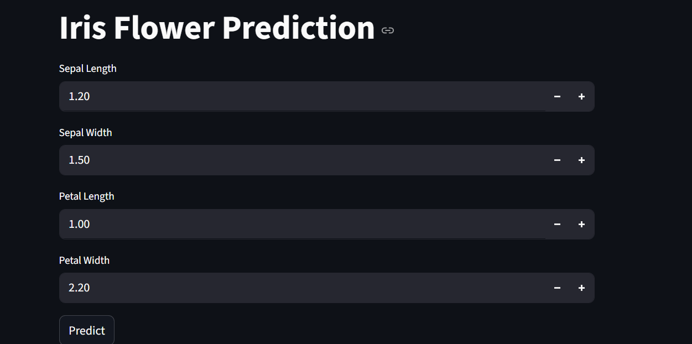
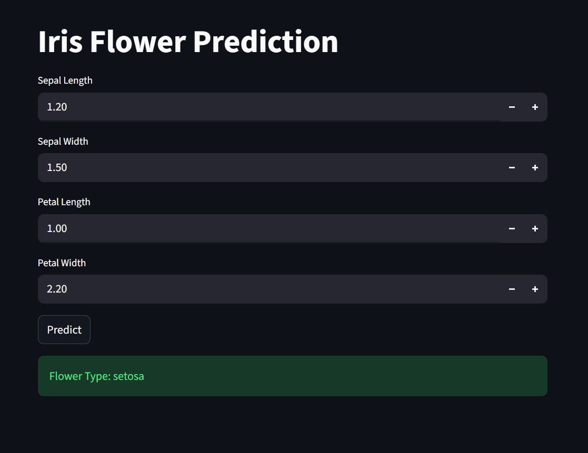

# 🌸 Iris Flower Prediction Web App

## 🔹 Project Overview

This project is a **Machine Learning Web Application** built using Python and Streamlit.
It predicts the **type of Iris flower** based on user input features.

The model is trained using the **Iris dataset** and uses classification algorithms.

---

## 🔹 Input UI (Example)



---

## 🔹 Output Result (Example)




---

## 🔹 Technologies Used

1. Python
2. Streamlit (Frontend)
3. Scikit-learn (ML Models)
4. Pandas & NumPy (Data Processing)
5. Joblib (Model Saving)

---

## 🔹 Features

1. Simple user interface
2. Takes flower measurements as input
3. Predicts flower type instantly
4. Uses trained ML model
5. Displays result clearly

---

## 🔹 Input Parameters

User needs to enter:

1. Sepal Length
2. Sepal Width
3. Petal Length
4. Petal Width

---

## 🔹 How It Works

1. User enters input values
2. Data is scaled using StandardScaler
3. Model predicts the flower type
4. Output is displayed on screen


## 🔹 Installation Steps

1. Install required libraries:

   ```bash
   pip install pandas numpy scikit-learn streamlit joblib
   ```

2. Run training script:

   ```bash
   python train.py
   ```

3. Run Streamlit app:

   ```bash
   streamlit run app.py
   ```

---

## 🔹 Project Structure

```
Iris_Project/
│
├── iris.csv
├── train.py
├── app.py
├── model.pkl
├── scaler.pkl
├── encoders.pkl
└── README.md
```

---

## 🔹 Output

The app predicts one of the following:

1. Setosa
2. Versicolor
3. Virginica

---

## 🔹 Conclusion

This project demonstrates how machine learning can be used to build a simple and interactive prediction system. It is easy to understand and suitable for beginners.

---
